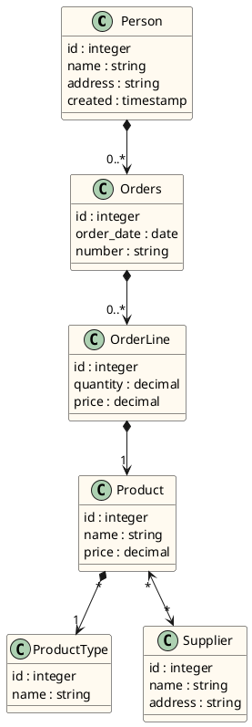

# Spring boot JPA Demo

## Model

### Reference Documentation
For further reference, please consider the following sections:

* [Official Apache Maven documentation](https://maven.apache.org/guides/index.html)
* [Spring Boot Maven Plugin Reference Guide](https://docs.spring.io/spring-boot/docs/3.0.2/maven-plugin/reference/html/)
* [Create an OCI image](https://docs.spring.io/spring-boot/docs/3.0.2/maven-plugin/reference/html/#build-image)
* [Spring Data JPA](https://docs.spring.io/spring-boot/docs/3.0.2/reference/htmlsingle/#data.sql.jpa-and-spring-data)
* [Flyway Migration](https://docs.spring.io/spring-boot/docs/3.0.2/reference/htmlsingle/#howto.data-initialization.migration-tool.flyway)

### Guides
The following guides illustrate how to use some features concretely:

* [Accessing Data with JPA](https://spring.io/guides/gs/accessing-data-jpa/)

